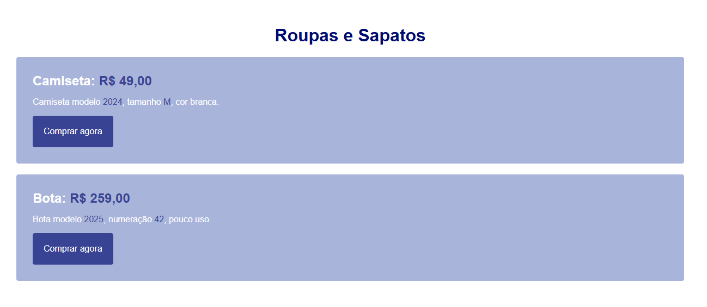

# 02 - Clothes and Shoes

Practice exercise with product cards for a t-shirt and a boot, using a blue/indigo theme.

## Colors

| Name | Hex | Usage |
|---|---|---|
| Dark Blue | `#000A6F` | Title (h1) |
| Indigo | `#384393` | Button background |
| Gray Blue | `#717CB7` | Price (highlight) |
| Light Blue | `#A9B4DB` | Card background |
| Very Light Blue | `#E1EDFF` | (available, not used) |
| White | `#fff` | Button text / description text / page background |

## Preview

